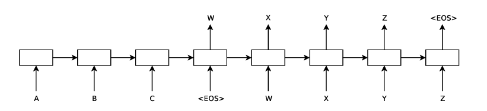
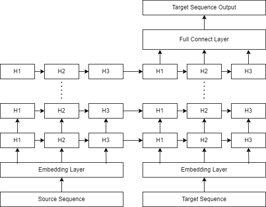
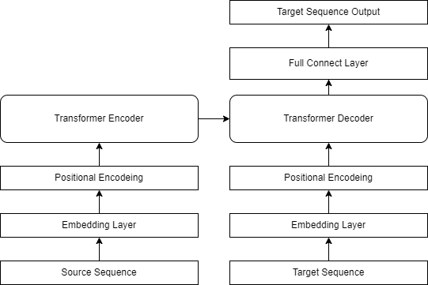
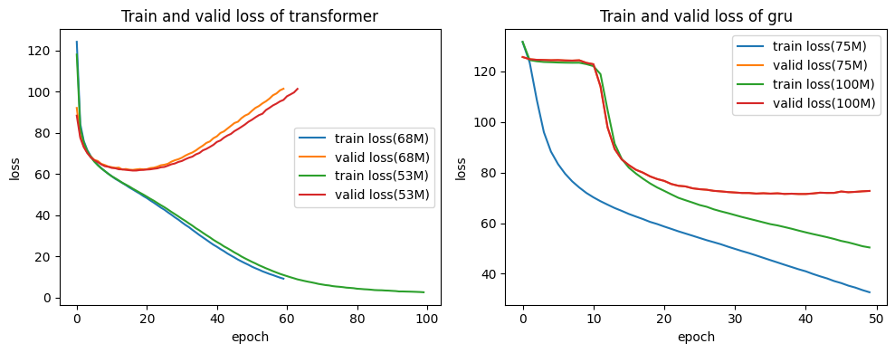
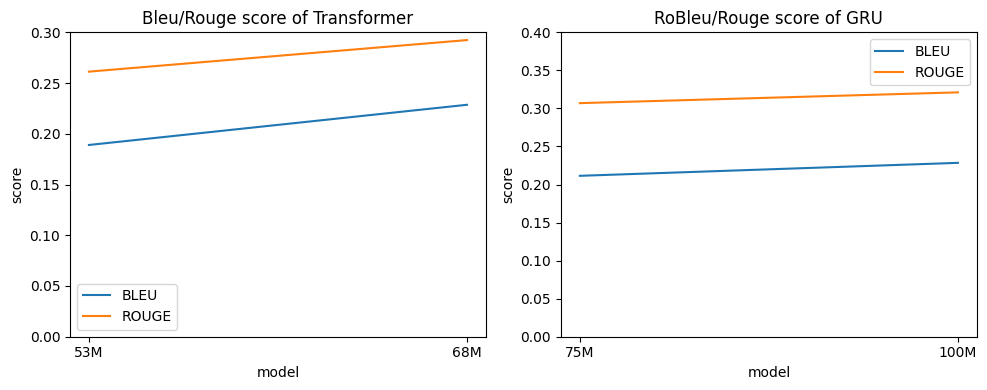

## 概述

在实验中，我实现了两种seq2seq fashion的生成式文本摘要模型用于完成实验任务，分别是：

- 使用GRU作为循环神经网络层的Enocder-Decoder模型
- 基于Pytorch 中的`torch.nn.TransformerEncoderLayer, torch.nn.TransformerDecoderLayer`的Encoder-Decoder模型

### 运行代码

要运行代码，我们需要安装下面的package

```
# Requirments
torch==2.1.0
torch-cluster==1.6.3+pt21cu121
torch-scatter==2.1.2+pt21cu121
torchvision==0.16.0
torchaudio==2.1.0
nltk==3.8.1
scikit-learn==1.3.1
pandas==2.0.3
pandas-profiling==3.6.6
rouge==1.0.1
tqdm==4.66.1
```

随后可以通过下面的方式运行代码

TL;DR: `python main.py Transformer/GRU`

```
(torch_drug) root@5e57e95ea2c5:~/nlp/dase-ai-nlp/src# python main.py -h
usage: main.py [-h] [--data_path DATA_PATH] [--valid_size VALID_SIZE] [--random_state RANDOM_STATE]
               [--batch_size BATCH_SIZE] [--epochs EPOCHS] [--lr LR] [--vocab_size VOCAB_SIZE] [--save_path SAVE_PATH]
               [--save_name SAVE_NAME] [--save_model] [--load_path LOAD_PATH] [--load_model] [--trace_time] [--test]
               [--valid_loss] [--encoder_layers ENCODER_LAYERS] [--decoder_layers DECODER_LAYERS]
               [--hidden_size HIDDEN_SIZE] [--embedding_size EMBEDDING_SIZE] [--num_heads NUM_HEADS]
               [--direction DIRECTION]
               model

positional arguments:
  model

optional arguments:
  -h, --help            show this help message and exit
  --data_path DATA_PATH
                        path to data
  --valid_size VALID_SIZE
                        validation dataset ratio
  --random_state RANDOM_STATE
                        random state for splitting dataset
  --batch_size BATCH_SIZE
                        batch size
  --epochs EPOCHS       number of training epochs
  --lr LR               learning rate
  --vocab_size VOCAB_SIZE
                        vocabulary size
  --save_path SAVE_PATH
                        save model to save_path with save_name
  --save_name SAVE_NAME
                        save model to save_path with save_name
  --save_model          save model to save_path
  --load_path LOAD_PATH
                        load model from load_path
  --load_model          load model from load_path
  --trace_time          trace time for training
  --test                evaluate on test set
  --valid_loss          calculate validation loss every epoch
  --encoder_layers ENCODER_LAYERS
                        number of layers in encoder
  --decoder_layers DECODER_LAYERS
                        number of layers in decoder(should be the same as encoder)
  --hidden_size HIDDEN_SIZE
                        hidden size of both encoder and decoder, for GRU it is the number of hidden units, for Transformer it is the dimension of feedforward layer
  --embedding_size EMBEDDING_SIZE
  --num_heads NUM_HEADS
                        number of heads in multi-head attention, in Transformer only
  --direction DIRECTION
                        direction of encoder and decoder, 1 for unidirectional, 2 for bidirectional, in GRU only
```

或者使用运行脚本`./scripts/`，包括

```
train_gru.sh 训练两种基于GRU的模型
train_transformer.sh 训练两种基于Transformer的模型
track_train_time.sh 记录训练时间
valid.sh 加载训练好的模型，并在验证集上评估BLEU/ROUGE
test.sh 加载训练好的模型，并在测试集上评估BLEU/ROUGE
```

例如`bash train_transformer.sh`

### 目录结构

```
./assets: readme中插入的图片
./data: 实验用数据
./scripts: 训练/测试用脚本
./outputs: 训练/测试输出
./src: 源代码
```

## 实验过程

### 预处理

#### 填充和截断

在常见的深度学习实现中，我们需要将一组输入样本$x_1, x_2, ..., x_n \in \mathbb R^d$看作一个batch，打包为一个维度为$(n, d)$的张量作为模型的输入传递进去，这样做一方面可以帮助我们更好地利用并行计算带来的效率提升；另一方面，在较大的batch上计算得到的梯度往往也更具代表性，能够帮助backpropagation的训练算法更好地优化模型。

然而对于作为句子对的输入样本而言，考虑到每个句子的长度不同，输入样本的维度本身就是完全不同的，如果我们仍想要将输入看作若干个batch，我们就需要手动将所有句子更改为同一长度，也就是填充和截断的作用。

具体来说，在预处理过程中，我将所有句子填充到同样的长度`max_len = 128`，使用特殊的`pad_token = 0`来填充句子，具体地实现位于`./src/utils::MedicalDataset`中。经过预处理后，我们从DataLoader中读取到的数据包括

- `description: shape(batch_size, max_len): 病情描述，在seq2seq中作为source`
- `diagnosis: shape(batch_size, max_len): 病情描述，在seq2seq中作为target`
- `desc_len: shape(batch_size,): description的有效长度（不包含pad_token，但包含bos/eos)`
- `diagn_len: shape(batch_size,): diagnosis的有效长度（不包含pad_token，但包含bos/eos)`

返回的句子的有效长度会在构造Transformer模型的mask中被使用

#### 添加bos/eos token

除了填充之外，我们还希望让模型学习到序列的自然结束位置与开始位置，所以我们需要添加bos/eos token。由于所有的句子都需要提供eos token，而bos token只有target句子需要，因此在上面提到的实现中，我为所有的source/target 句子末尾添加eos token，而在训练/推理时再手动为target句子添加bos token（如果需要）

#### 词表大小

在embedding过程中，我们需要建立对应的词向量，因此我们需要知道语料中词元的种类数来作为我们的词表大小。在实际实现中，我检查了语料中的所有词元，最终建立的词表大小为1300

### 模型的实现

常见的seq2seq的设计有两种[1-2]，他们的区别在于对编码器输出的隐状态/中间表示的处理，我选择了较为简单，也更为广泛使用的一种[1]：直接用编码器的最后一个时间步的隐状态来初始化解码器的隐状态，如下图所示。



#### 基于GRU的实现



如上图所示，基于Pytorch中`torch.nn.GRU`的模型实现(`./src/models/gru.py`)具体包括：

- 编码器：输入的description/source 经过嵌入层与多层GRU，得到最后一个时间步的隐状态。
- 解码器：输入的diagnosis/target经过嵌入层，与来自编码器的隐状态一同被输入给多层GRU网络，随后我们将多层GRU的输出序列通过全连接层映射回原先的词元

在实现中，我简单地用编码器GRU层的隐状态来初始化解码器对应GRU层的状态，因此需要满足编码器与解码器的GRU层数一致，实际上这并不是一个好的实践，但对于简单任务已经够用了。

#### 基于Transformer的实现



正如我没有手动从零实现GRU层一样，我也没有手动实现Transformer[3]的各层结构，而是利用PyTorch为我们提供的`torch.nn.TransformerEncoderLayer`与`torch.nn.TransformerDecoderLayer`来简化实现工作。与基于GRU的实现类似。

- 编码器：输入的description/source 经过嵌入层与位置编码，通过Transformer Encoder得到中间表示(memory)
- 解码器：输入的diagnosis/target经过嵌入层与位置编码，与来自编码器的中间表示一同被输入给Transformer Decoder，随后通过全连接层映射回原先的词元

##### 位置编码的实现

`./src/utils.py::PositionalEncoding`

为了帮助我们的模型学习到序列的顺序信息，我们需要在输入中手动强制性地添加词元的位置信息。我在代码中实现了常用的基于正弦函数和余弦函数的位置编码矩阵$P$的生成方法：
$$
p_{i, 2j} = \sin (\frac{i}{\exp(\ln(10000) * \frac{2j}{d})}) \\
p_{i, 2j+1} = \cos (\frac{i}{\exp(\ln(10000) * \frac{2j}{d})})
$$
其中$d = embedding\_size$，通过在经过嵌入层后的句子表示矩阵上添加编码矩阵$P$，我们可以在attention的过程中保留词元的位置信息。

##### 使用mask

在self-attention的过程中，我们需要对每个token和其它token进行注意力汇聚操作，对于编码器中的self-attention层来说，这是很自然的，因为我们在任何时候都拥有完整的source序列。然而，在我们通过解码器生成目标句子时，我们应当只依赖目前已经生成的词元，这要求模型在训练时不使用来自某一词元后的其它词元的注意力信息。在Pytorch中，这一mask被称为**src_mask, tgt_mask, memory_mask**，在我们的任务中，对于source序列，编码器自然可以使用全部的信息，而解码器也可以使用编码器输出的memory中的全部信息，所以src_mask / memory_mask 都可以使用所有元素为0的矩阵，而对于tgt_mask，我们需要让解码器在训练时不使用之后的信息，所以最终的tgt_mask应当是三角矩阵。

生成这些mask的实现位于`./src/utils.py::generate_square_subsequent_mask`。

除了在self-attention过程中使用的mask外，我们还需要屏蔽填充词元pad_token的影响，在Pytorch的实现中，我们需要提供***_key_padding_mask来屏蔽对应位置的填充。

我们在预处理的过程中保存了每个序列的有效长度，所以我们只需要根据句子的有效长度生成对应的布尔矩阵即可。

生成这些mask的实现为`./src/utils.py::generate_length_mask， ./src/utils.py::generate_masks`。

```
示例mask:
source = [4, 7, 2(eos), 0]
target = [124, 2(eos), 0, 0]

src_mask = memory_mask =
[[0, 0, 0, 0],
 [0, 0, 0, 0],
 [0, 0, 0, 0],
 [0, 0, 0, 0]]
 
tgt_mask=
[[0, -inf, -inf, -inf],
 [0, 0, -inf, -inf],
 [0, 0, 0, -inf],
 [0, 0, 0, 0]]
src_padding_mask = memory_padding_mask = [False, False, False, True]
tgt_padding_mask = [False, False, True, True]
```

### 训练模型

模型训练过程的实现代码位于`./src/task.py::train_model`

#### 损失函数

正如我在模型结构中展示的那样，我希望模型最后通过全连接层输出的是每个词元属于词表中的某个词的**概率分布**，这样我们就可以可以用类似于多分类问题的方法，采用**交叉熵**作为损失函数来优化模型。

不过在训练时，我们还需要解决填充词元的问题，和对于mask的讨论类似，我们不希望填充词元能影响到梯度的计算，所以我们在损失函数中忽略真实结果中为填充词元(pad_token=0)的位置的计算

```
criterion = nn.CrossEntropyLoss(ignore_index=0, reduction="sum") # NOTE our pad_token = 0
```

#### 强制学习

我们已经知道，解码器在生成target序列中的某个词元$d_t$的时候，需要首先接受前$t-1$个词元作为输入，在训练时，我们需要考虑接受的前$t-1$个词元是模型自身预测的词元，还是来自训练集中target的前$t-1$个词元。在实现中，我选择了强制学习(Teacher Forcing)的训练方法，即使用真实词元作为输入，这一方法的优点包括：

- 对于每个生成的序列，我们不需要多次调用模型生成下一步词元，而只需要让模型接受所有真实词元作为输入即可，减少了训练时的运算量，提升了训练效率
- 强制学习可以避免前$t-1$步词元预测错误带来的误差累积，在模型训练初期，$d_t$的预测误差受到之前词元的累积影响，会始终保持一个较大的值，从而使模型难以收敛

#### 实现细节

我们知道，解码器的作用是从前$t-1$个输入词元预测第$t$个词元，而对于句子中的第一个词元，我们则通过特殊的bos_token来进行预测。结合之前提到的强制学习的要求，在实现的训练代码中，我在训练集中的每个target sequence的起始位置添加了bos_token。不过，需要注意的是，尽管模型用于预测的输入是添加了bos_token后的结果，但在损失函数计算时，我们传入的真实结果是添加bos之前的target sequence，这样才能让模型学习到正确的内容。

例如：

- 真实target: 12, 34, 100, 2(eos), 0, 0
- 输入的target：1(bos), 12, 34, 100, 2, 0 
- 用于计算损失函数的target：12, 34, 100, 2(eos), 0, 0

如果错误地在损失函数中使用了包含bos的target，就会导致模型的预测结果**全为bos**，此时模型学习的是输入target词元的在编码器隐藏状态条件下的表征，而我们在预测时输入的第一个词元都是bos，且始终将之前生成的词元输入给模型，所以模型始终都是在输入bos词元的前提下输出预测的bos词元。

采用的优化器为`AdamW`，学习率`lr = 0.0001`

### 生成文本摘要

与训练过程不同，在生成摘要的过程中，我们没有真实的target序列信息，所以我们只能从向训练好的模型输入bos_token开始，逐步将生成的新token作为输入再生成新的token，直到我们遇到eos_token，或者达到生成序列的最大长度为止。

这部分的实现位于对应模型的`predict`方法下。

### 评估指标

在实验中，我采用了两种指标来评估模型的生成结果，分别为BLEU和ROUGE：

- nltk中的BLEU实现，使用了拉普拉斯平滑技术，是BLEU-1, BLEU-2, BLEU-3, BLEU-4的几何平均，具体计算方式为

  对于句子对$(candidate, reference)$
  $$
  bleu_n = \frac{\sum_{n-gram \in candidate}Count_{clip}(n-gram) + \epsilon}{\sum_{n-gram^\prime \in candidate}Count(n-gram^\prime) + \epsilon}
  \\
  bleu = \sqrt[4] {\Pi_1^4 bleu_i}
  $$
  其中$\epsilon$是平滑因子，取值为$0.1$

- rouge中的ROUGE实现，采用rouge-1算法的召回率作为最终得分

  对于句子对$(summary, reference)$
  $$
  rouge_n = \frac{\sum_{n-gram \in reference}Count_{match}(n-gram) }{\sum_{n-gram^\prime \in reference}Count(n-gram^\prime)}
  $$
  其中$Count_{match}$计算参考摘要与生成摘要是否共有n-gram

上面两种算法都是基于句子对之间的评分，我采用所有(source, prediction target)对的平均得分作为模型的最终评分。

## 实验结果与分析

在整个实验中，我训练了以下模型，超参数取值包括:

| Name              | Epochs* | Encoder/Decoder Layers | Embedding_size | FeedForward Dimension/ Hidden Dimension | Heads | Training Time(seconds) |
| ----------------- | ------- | ---------------------- | -------------- | --------------------------------------- | ----- | ---------------------- |
| GRU100M-ES        | 43      | 8                      | 512            | 1024                                    | /     | 1772.01                |
| GRU75M-ES         | 25      | 6                      | 512            | 1024                                    | /     | 783.04                 |
| Transformer68M-ES | 16      | 8                      | 512            | 2048                                    | 8     | 876.37                 |
| Transformer53M-ES | 16      | 6                      | 512            | 2048                                    | 8     | 664.12                 |

在测试集上的结果为

|             | BLEU   | ROUGE      | Name              |
| ----------- | ------ | ---------- | ----------------- |
| GRU         | 0.2368 | **0.3233** | GRU100M-ES        |
| Transformer | 0.2369 | 0.2917     | Transformer68M-ES |

### 确定合适的epochs

为了缓解模型过拟合的问题，我在训练过程中的每个epoch训练完之后都在**验证集**上计算误差，采用Early Stopping的策略，通过每个epoch的验证集误差来选取不同模型的合适的训练用epoch，并重新进行训练，最终得到用于评价的训练完成的模型。



### Transformer vs GRU

从上面的实验结果来看，基于GRU的模型有着好得多的性能表现。但是，目前用于处理此类任务的模型大多是基于Transformer的，除了在并行计算效率上的优势外，得益于其中的残差连接结构，我们能够使用Transformer作为backbone构建更庞大的模型来更好的解决问题。我的实验结果验证了这一点，随着模型参数的增加，基于Transformer的模型的性能表现有很大的上升，而基于GRU的模型的上升幅度较小。



不过模型的大小受到硬件条件的制约，尤其是内存/显存容量的限制，所以我没有考察继续增大Transformer模型大小是否仍有性能上的提升，但可以预想，随着基于Transformer的模型的层数加深，我们可以训练出性能好得多的模型来完成任务。

### 模型评估指标

在实验中，我采用了BLEU和ROUGE两种评估指标，这两种指标都是被广泛使用的自然语音处理的评价指标。但基于n-gram的准确率/召回率的算法也有其固有的缺点，包括：

- BLEU指标的算法会偏向对较短的候选文本给出较高的分数
- 两种算法都不能处理同义词的情况等

在实际应用场景中，除了这些指标外，我们还可以通过人工被试者的评分来衡量模型的效果，这也是最为合理的指标之一，许多有影响力的工作，如GNMT[4]都采用了这一指标来说明模型的真实世界作用。

## 总结

在实验中，我实现了两种seq2seq的模型来解决生成式文本摘要问题，并采用BLEU和ROUGE两个指标来评估我实现的模型。在实现模型的过程中，我对Encoder-Decoder Fashion和Transformer有了更为深刻的理解，我还简单研究了两种backbone模型在增加模型大小时的区别，意识到Transformer因为其可扩展性强，并行计算友好等特点，被多种大型网络广泛使用为backbone模型。

## Reference

[1]I. Sutskever, O. Vinyals, and Q. V. Le, "Sequence to sequence learning with neural networks," in *Advances in Neural Information Processing Systems*, vol. 27, 2014.

[2]K. Cho et al., "Learning phrase representations using RNN encoder-decoder for statistical machine translation," *arXiv preprint arXiv:1406.1078*, 2014.

[3]A. Vaswani et al., "Attention is all you need," *Advances in Neural Information Processing Systems*, vol. 30, 2017.

[4]Y. Wu et al., "Google's neural machine translation system: Bridging the gap between human and machine translation," *arXiv preprint arXiv:1609.08144*, 2016.
